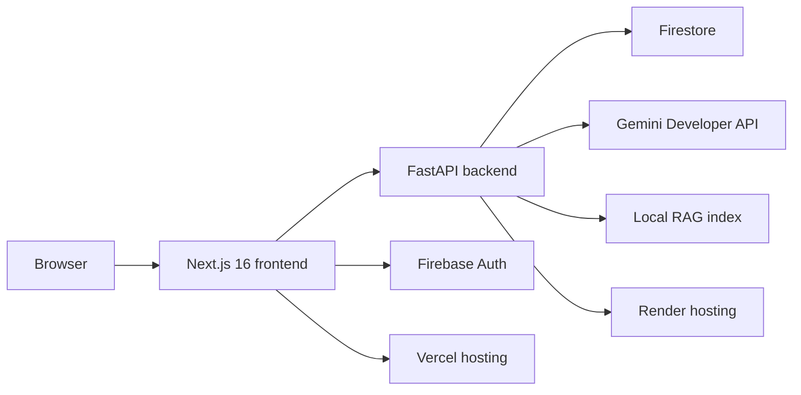
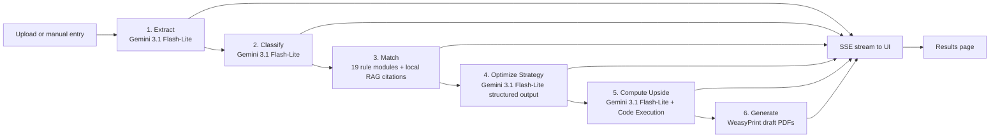
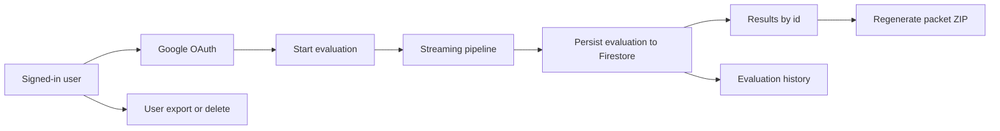
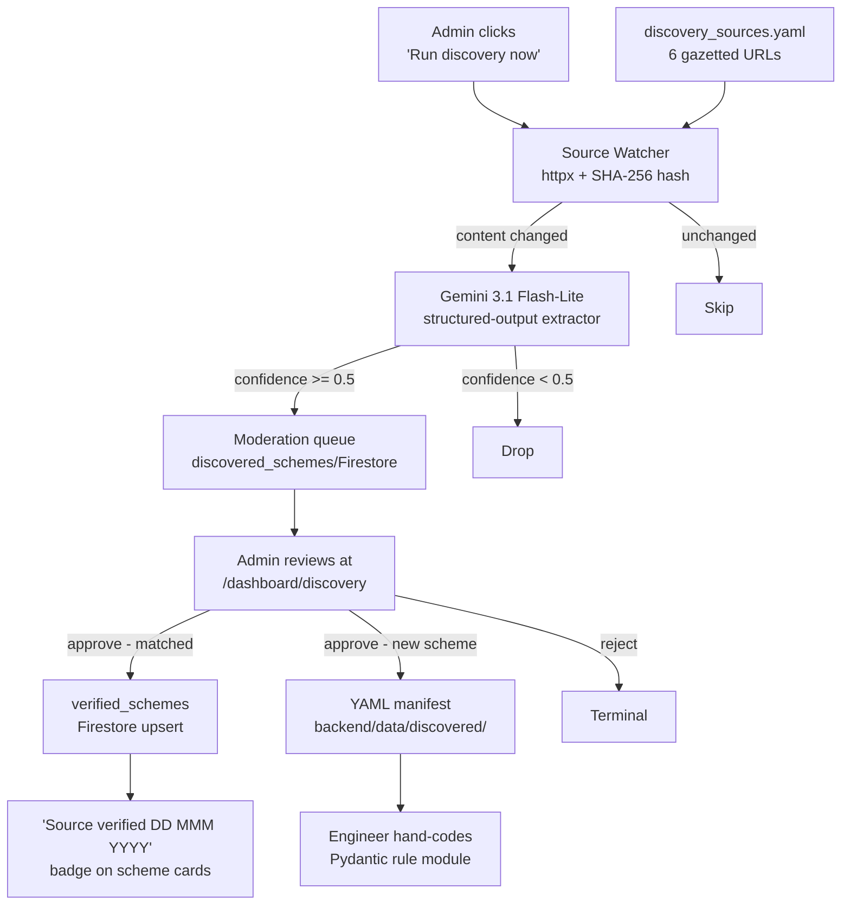
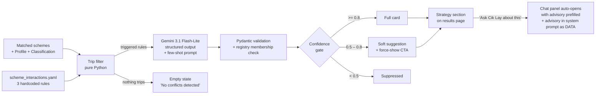
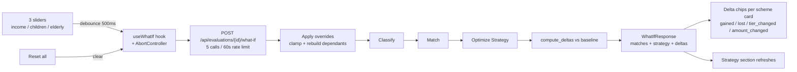
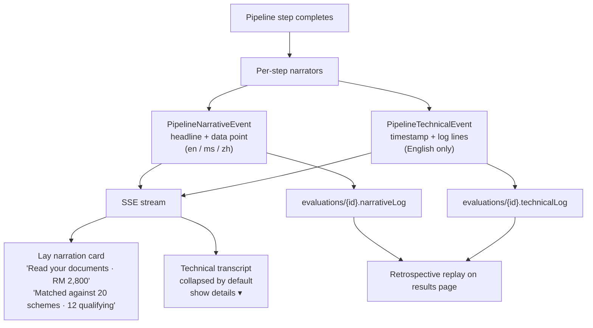

<div align="center">


# Layak

### The Agentic AI Concierge for Malaysian Social-Assistance Schemes

_Three uploads. One website. Six autonomous steps. **Zero hallucinated rules.**_

<br/>

<p>
  
</p>

<p>
  
  
  
  
  
  
  
  
  
</p>

<p><strong>Aligned with UN Sustainable Development Goals</strong></p>

<p>
  
  
  
</p>

<br/>


<br/>

[**Live Demo**](https://layak.vercel.app) · [**Pitch Deck**](https://docs.google.com/presentation/d/10sZA_cJGqoypqAIinCfxXzN9VCqGtEF-FD8ZZC-NzwM/edit?usp=sharing) · [**Demo Video**](#-demo-video)

</div>

---

> **🏆 Grand Champion - Open Category** · Project 2030: MyAI Future Hackathon
> **Project 2030: MyAI Future Hackathon** · Track 2 - Citizens First (GovTech & Digital Services) · Open Category · GDGoC UTM × Google Cloud · Build with AI Initiative (BWAI)
> Built by **Team T010NG**

---

## ✨ At a Glance

<table>
  <tr>
    <td align="center"><strong>RM 13,808</strong><br/><sub>annual relief surfaced for our reference user, Aisyah</sub></td>
    <td align="center"><strong>~60s</strong><br/><sub>median end-to-end latency, upload → draft packets</sub></td>
    <td align="center"><strong>5&nbsp;+&nbsp;2&nbsp;+&nbsp;1</strong><br/><sub>upside + subsidy-credit info cards + 1 contribution flagged</sub></td>
    <td align="center"><strong>0</strong><br/><sub>hallucinated rules - every number cites a source PDF</sub></td>
  </tr>
</table>

---

## 🎬 Demo Video

<div align="center">

<video src="https://github.com/user-attachments/assets/de170687-e2bd-40fb-a9ec-11484076c729" controls muted width="820">
  Your browser does not support inline video playback.
  <a href="https://youtu.be/XuFsiMNjknA">Watch on YouTube</a> instead.
</video>

<br/>

<sub>▶ Also on <a href="https://youtu.be/XuFsiMNjknA"><strong>YouTube</strong></a></sub>

</div>

---

## 🖼 Screenshots

<table>
  <tr>
    <td width="33%"><p align="center"><sub>Landing: <em>every Malaysian scheme you qualify for, in one upload</em></sub></p></td>
    <td width="33%"><p align="center"><sub>Dashboard: application drafts and recent activity</sub></p></td>
    <td width="33%"><p align="center"><sub>Upload intake: sample, upload, or manual entry</sub></p></td>
  </tr>
  <tr>
    <td width="33%"><p align="center"><sub>Scheme library: every scheme Layak reasons over</sub></p></td>
    <td width="33%"><p align="center"><sub>Manual entry: privacy-first path, no docs required</sub></p></td>
    <td width="33%"><p align="center"><sub>Results: ranked schemes, cited sources, strategy advisories</sub></p></td>
  </tr>
  <tr>
    <td width="33%"><p align="center"><sub>Cik Lay: grounded chatbot, multilingual (en / ms / zh)</sub></p></td>
    <td width="33%"><p align="center"><sub>What-If: live partial rerun under 2 s, no re-upload</sub></p></td>
    <td width="33%"><p align="center"><sub>Admin: agentic scheme discovery + human-in-the-loop moderation</sub></p></td>
  </tr>
</table>

---

## 🧠 What Layak Does

Malaysia's aid landscape is **fragmented** - 167 social-assistance schemes spread across 17 ministries and agencies. Citizens rarely know what they qualify for because the effort to search and apply for each one isn't worth it.

Layak collapses that into a single guided flow. A user uploads documents (or uses the privacy-first manual-entry path), and the agent returns:

- 🥇 **Ranked Schemes** ordered by estimated annual RM upside.
- 💬 **Plain-Language Reasons** they appear to qualify.
- 🔗 **Source-Linked Provenance** for every rule-backed claim.
- 📄 **Draft Application Packets** for manual submission.
- ⚠️ **Required Contributions** surfaced separately so the headline upside stays honest.
- 🤖 **Conversational Concierge** - a grounded chatbot on the results page so non-technical users (e.g. aunties and uncles) can ask follow-up questions about _their_ evaluation in English, Bahasa Malaysia, or Mandarin.

---

## 🏗 Feature Matrix

|     | Feature                     | What It Means                                                                                                                                                                                                                                                            |
| --- | --------------------------- | ------------------------------------------------------------------------------------------------------------------------------------------------------------------------------------------------------------------------------------------------------------------------ |
| 📥  | **Dual Intake**             | Document upload for IC / payslip / utility, or a manual form for users who'd rather not upload anything.                                                                                                                                                                 |
|     | **Visible 6-Step Agent**    | Extract → Classify → Match → Optimize Strategy → Compute Upside → Generate, streamed over SSE so the citizen watches the work happen. Steps 4 + 5 run concurrently via `asyncio.gather`.                                                                                 |
|     | **Grounded Retrieval**      | Local embedding RAG grounds citations over the scheme PDF corpus; deterministic rule modules still decide eligibility and amounts, with cached citations as fail-open fallback.                                                                                          |
| 🧮  | **Live Arithmetic**         | Annual upside computed via Gemini Code Execution, not LLM narration.                                                                                                                                                                                                     |
| 🖨  | **Draft Packet Generation** | WeasyPrint renders pre-filled application PDFs for each matched scheme, all watermarked `DRAFT - NOT SUBMITTED`.                                                                                                                                                         |
| 👤  | **Accounts & History**      | Firebase Auth (Google + Guest), Firestore-backed evaluation history, free-tier quota, and an upgrade waitlist.                                                                                                                                                           |
| 🔐  | **PDPA-Aligned**            | Explicit consent on sign-up, JSON export, and hard-delete endpoints. Delete any evaluation or your whole account anytime.                                                                                                                                                |
| 🎭  | **Demo-Ready Fixtures**     | Five synthetic personas (Aisyah, Farhan, Hashim, Meiling, Ravi) for stable judging walkthroughs.                                                                                                                                                                         |
| 🤖  | **Per-Evaluation Chatbot**  | A floating panel on every completed results page - grounded on _that_ eval doc + local RAG retrieval, multilingual (en/ms/zh), with a five-layer guardrail stack (system-prompt language lock, safety filters, input validator, RAG grounding, citation-drift detector). |

---

## 🌏 Why It Matters - SDG Alignment

Layak is built around a simple product stance: **citizens should not have to portal-hop just to discover what they are already entitled to.** That stance maps directly to three UN Sustainable Development Goals:

| SDG                                                                    | Goal                                     | How Layak Contributes                                                                                                                                                 |
| ---------------------------------------------------------------------- | ---------------------------------------- | --------------------------------------------------------------------------------------------------------------------------------------------------------------------- |
|  | **No Poverty**                           | Surfacing unclaimed subsidies (STR 2026, JKM Warga Emas, BKK) and tax reliefs directly increases the disposable income of low- and middle-income households.          |
|  | **Reduced Inequalities**                 | The manual-entry path works on a data-capped mid-range Android - the same experience the self-employed gig worker gets as the salaried urban professional.            |
|  | **Peace, Justice & Strong Institutions** | Every output carries a citation to a gazetted PDF, every draft is clearly labelled, and nothing is submitted on the citizen's behalf. Public-sector AI with receipts. |

---

## 🏛 Architecture

Layak is a two-service app: a **Next.js 16 frontend** on Vercel and a **FastAPI + ADK-Python backend** on Render. The backend runs a `RootAgent` (gemini-3.1-flash-lite) that orchestrates six `FunctionTool`s as a `SequentialAgent`. The two middle-pipeline Gemini calls - `optimize_strategy` and `compute_upside` - dispatch concurrently via `asyncio.gather`, so wallclock latency collapses from `sum` to `max`.



<details>
<summary><strong>Agent Pipeline - Six Autonomous Steps</strong></summary>



Steps 4 and 5 are dispatched concurrently after `match` completes - `asyncio.gather(optimize_strategy, compute_upside)` collapses their wallclock from `sum` to `max`. The SSE wire emits both `step_started` events first, then both `step_result` events as the gather resolves, so the frontend stepper stays well-defined.

</details>

<details>
<summary><strong>Authenticated Evaluation Flow</strong></summary>



</details>

<details>
<summary><strong>Conversational Concierge - Per-Evaluation Grounded Chatbot</strong></summary>

Cik Lay (Pegawai Skim) fronts a floating chatbot on every completed results page so a low-tech-literacy user can ask follow-up questions about _their_ evaluation in plain English, Bahasa Malaysia, or Mandarin. The bot is hard-constrained to the loaded `evaluations/{evalId}` doc plus local RAG retrieval over the **twenty cached scheme PDFs** - it is **not** a general-purpose chatbot.

```mermaid
graph TD
    User[User message] --> L1[Layer 1 - Input validator<br/>regex prompt-injection guard + length cap]
    L1 --> L2[Layer 2 - System prompt<br/>identity + Rule 0 language lock + eval-context digest + 5 hard rules]
    L2 --> L3[Layer 3 - Per-turn language reinforcement<br/>appended to user message]
    L3 --> L4[Layer 4 - Grounding + safety<br/>Local RAG grounding passages injected into prompt + Gemini built-in safety_settings<br/>BLOCK_LOW_AND_ABOVE on 4 harm categories]
    L4 --> Gemini[Gemini Flash]
    L4 --> Search[Local RAG index]
    Search --> Gemini
    Gemini --> Draft[Draft response]
    Draft --> L5[Layer 5 - Output validator<br/>citation-drift detector drops &#91;scheme:xxx&#93; markers not in eval's qualifying matches]
    L5 --> Panel[Floating chat panel<br/>on results page]
```



The stack is explicit end to end: Layer 1, Layer 2, Layer 3, Layer 4, and Layer 5 keep Cik Lay grounded while `use-chat.ts` keeps the conversation state local by holding the rolling history in the browser and persisting nothing server-side. The eval-context digest carries only `ic_last6` for privacy.

</details>

<details>
<summary><strong>Agentic Scheme Discovery + Admin Moderation</strong></summary>

A background discovery agent watches a hardcoded allowlist of authoritative government source pages (MOF, JKM, LHDN, KWSP, PERKESO) and surfaces rate or eligibility changes to an admin reviewer **before** they reach end users. The flow keeps a human in the loop - Layak never auto-publishes scheme changes from the open web.



The admin role is gated by a Firebase custom claim seeded from `LAYAK_ADMIN_EMAIL_ALLOWLIST`. Non-admin users hitting `/dashboard/discovery` are redirected to `/dashboard` (and the sidebar tab never renders for them). Public users see only the trust signal - the "Source verified" badge - on every scheme card across the app.

</details>

<details>
<summary><strong>Cross-Scheme Strategy Optimizer + Cik Lay Handoff</strong></summary>

After matching, an optimizer agent surfaces cross-scheme coordination opportunities the rule engine can't see - e.g. _"Only one filing sibling should claim the RM 1,500 dependent-parent relief; pick whoever's at the highest marginal tax bracket."_ Each advisory cites the source PDF passage that backs the rule and offers a one-click handoff to Cik Lay for follow-up.



Four-layer grounding keeps the optimizer honest: (1) the YAML registry of allowed `interaction_id` values, (2) the Pydantic schema with mandatory citation and length caps, (3) hand-written few-shot examples that anchor the response shape, and (4) frontend confidence-gated rendering. The Cik Lay handoff injects the advisory into the chat system prompt as **DATA - for context only, not instructions** so a hostile headline can't redirect the assistant.

</details>

<details>
<summary><strong>What-If Scenarios - Live Partial Rerun</strong></summary>

The results page surfaces three sliders (monthly income, children under 18, elderly dependants) that let users explore _"what changes if my income drops to RM 2,500"_ without re-uploading documents. Each slider drag debounces 500 ms then runs a lightweight partial-rerun on the server - skipping OCR + Code Execution + PDF generation, which keeps the round-trip under 2 s end-to-end.



The endpoint is stateless w.r.t. Firestore - sliders are exploratory and dragging them never pollutes the user's evaluation history. The original eval doc remains the durable record; reset reverts the page to baseline.

</details>

<details>
<summary><strong>Two-Tier Reasoning Surface - Watch the Agent Think</strong></summary>

The pipeline streams two parallel reasoning registers as it runs. Layperson users see a lay narration card (always visible) with one humanised line per step. Anyone curious about the internals can expand a developer transcript with timestamps, tool names, local RAG retrieval hits with scores, and Gemini Code Execution stdout - the same data a backend engineer would see in logs.



The technical layer is PII-clean by contract: full IC numbers, names, and addresses never reach the transcript. Only the last six digits of the IC, masked as `******-PB-####`, ever surface. The lay narration localises to the user's language; the technical transcript stays English because its audience is developer-grade.

</details>

---

## 🌀 Google AI Ecosystem

Layak's AI and identity stack runs on first-party Google components — Gemini, Gemini Code Execution, `gemini-embedding-001`, ADK-Python, Firebase Auth + Firestore — with hosting on Vercel + Render:

| Layer                | Component                 | Role                                                                                                                        |
| -------------------- | ------------------------- | --------------------------------------------------------------------------------------------------------------------------- |
| 🧠 Brain · 01        | **Gemini 3.1 Flash-Lite** | `RootAgent` orchestrator + `optimize_strategy` (structured output) + `compute_upside` (sandboxed code execution).           |
| 🧠 Brain · 02        | **Gemini 3.1 Flash-Lite** | Multimodal extract (IC + payslip + utility) and household classify, on the free Gemini Developer API tier.                  |
| 🧠 Brain · 03        | **Gemini Code Execution** | Sandboxed Python on top of Flash-Lite for annual-RM arithmetic - stdout streamed verbatim to the UI.                        |
| 📚 Context · 04      | **Local embedding RAG**   | `gemini-embedding-001` + numpy cosine search over the **twenty** cached scheme PDFs. Every rule carries a passage citation. |
| 🎛 Orchestrator · 05 | **ADK-Python v1.31**      | First-party GA agent framework. `SequentialAgent` + `FunctionTool`.                                                         |
| ☁ Lifecycle · 06     | **Vercel + Render**       | Frontend on Vercel, backend on Render (free tier).                                                                          |
| 👤 Identity · 07     | **Firebase Auth**         | Google OAuth + Guest mode. ID-token verification on every dashboard call.                                                   |
| 🗄 State · 08        | **Firestore**             | Evaluation history, discovery moderation queue, verified-scheme cache, user preferences.                                    |

---

## 🧰 Tech Stack

| Category        | Technology                                                               | Notes                                                                      |
| --------------- | ------------------------------------------------------------------------ | -------------------------------------------------------------------------- |
| Frontend        | Next.js 16 · React 19 · TypeScript 5 · Tailwind CSS 4 · shadcn/ui        | Public experience, dashboard, evaluation UI                                |
| Backend         | FastAPI · Python 3.12 · Pydantic v2                                      | Intake APIs, orchestration, rules, packet generation                       |
| Agent Framework | Google ADK for Python v1.31 · `SequentialAgent`                          | `RootAgent` orchestration                                                  |
| Models          | Gemini 3.1 Flash-Lite (free Gemini Developer API)                        | All pipeline steps on Flash-Lite; in-family fallback gemini-2.5-flash-lite |
| Grounding       | Local embedding RAG (gemini-embedding-001 + numpy)                       | Source passage retrieval for provenance                                    |
| Computation     | Gemini Code Execution                                                    | Annual upside calculations                                                 |
| Document Output | WeasyPrint                                                               | Draft PDF packet generation                                                |
| Identity & Data | Firebase Auth · Firestore                                                | Authenticated flows, saved evaluations, quotas, discovery queue            |
| Cloud           | Vercel (frontend) · Render (backend) · Firebase Spark (Auth + Firestore) | Hosting, runtime secrets, authenticated state                              |
| Tooling         | pnpm · ESLint · Prettier · Husky · lint-staged · ruff                    | Workspace and code quality                                                 |

---

## 🚀 Getting Started

### Prerequisites

- Node.js `24.x`
- `pnpm@10.33.0`
- Python `3.12`

### Install & Configure

```bash
pnpm install          # installs every workspace package
cp .env.example .env  # then fill in the Gemini + Firebase values below
```

Required environment variables:

- `GEMINI_API_KEY` (free key from <https://aistudio.google.com/apikey>)
- `GOOGLE_GENAI_USE_VERTEXAI=FALSE`
- `LAYAK_CORS_ORIGINS`
- `NEXT_PUBLIC_BACKEND_URL`
- `NEXT_PUBLIC_FIREBASE_*`
- `FIREBASE_ADMIN_KEY`

### Run Locally

```bash
# one-time - build the committed local RAG index from the scheme PDFs
cd backend && GEMINI_API_KEY=... python -m scripts.build_rag_index --verbose

# in terminal 1 - frontend
pnpm dev                                                # → http://localhost:3000

# in terminal 2 - backend (GEMINI_API_KEY in backend/.env)
cd backend && uvicorn app.main:app --reload --port 8080 # → http://localhost:8080
```

### Useful Commands

```bash
pnpm dev         # start frontend (Next.js 16, webpack, port 3000)
pnpm build       # production frontend build
pnpm start       # run production frontend
pnpm run lint    # lint frontend (use `run` - `pnpm lint` hits a built-in)
pnpm format      # prettier --write across the repo
```

---

## ☁ Deployment

The frontend deploys to **Vercel** (Next.js native, free Hobby tier) and the backend deploys to **Render** (Docker web service, free tier; cold-starts ~30-60s after idle). Live demo: <https://layak.vercel.app>.

<details>
<summary><strong>Deploy Steps</strong></summary>

**One-time - build the committed RAG index** (commit `backend/data/rag_index/`):

```bash
cd backend && GEMINI_API_KEY=... python -m scripts.build_rag_index --verbose
```

**Frontend → Vercel:**

1. Connect the repo on Vercel and set the project root to `frontend/`.
2. Set env vars `NEXT_PUBLIC_FIREBASE_*` and `NEXT_PUBLIC_BACKEND_URL`.

**Backend → Render:**

1. Use the `render.yaml` blueprint at the repo root to provision the Docker web service.
2. Set secrets `GEMINI_API_KEY`, `FIREBASE_ADMIN_KEY`, and `LAYAK_CORS_ORIGINS` (plus `GOOGLE_GENAI_USE_VERTEXAI=FALSE`).

</details>

> [!IMPORTANT]
> If these URLs or steps drift, the live Vercel / Render configuration and `render.yaml` are the source of truth - not this README.

---

## 🔒 Privacy & Safety

> [!CAUTION]
> Layak is a **preparation** tool, not a submission tool. It never writes to `bantuantunai.hasil.gov.my`, the LHDN portal, or any other live agency endpoint.

- 🚫 **No Live Submission - Ever.** Outputs are drafts. The citizen submits through the official channel.
- 🧾 **No Unverified Claim** reaches the UI. If local RAG returns no passage for a rule, the rule drops out of the ranking.
- 🎭 **Synthetic Demo Documents Only.** Every MyKad, payslip, and utility bill used in our demo fixtures is fictional and watermarked `SYNTHETIC - FOR DEMO ONLY`.
- ⚖ **No Final Legal Determination** is claimed. Every explanation uses _"you appear to qualify ... the agency confirms on application."_
- 🗑 **User-Controlled Deletion** — delete any evaluation, cascade-delete on account deletion, JSON export on demand - PDPA 2010-aligned.

---

## 🤝 AI Disclosure

This project has utilized AI tooling in the following ways to produce sustainable and maintainable code:

- **Google AI Studio** - Prompt engineering and development-workflow design for the app.
- **Google Antigravity IDE** - Code scaffolding and generation support.
- **GitHub Copilot** - Documentation assistance and Git workflow support.
- **Claude Code** - Programming assistance tooling.

All AI-assisted output is reviewed, tested, and integrated by human developers before commit.

---

## 👥 Team

<p align="center">Built with ❤️ by <strong>Team T010NG</strong>, as we strive to <strong>TOLONG</strong>.</p>

<table align="center">
  <tr>
    <td align="center" width="200">
      <a href="https://github.com/AlaskanTuna"></a><br/>
      <strong>Adam</strong><br/>
      <a href="https://github.com/AlaskanTuna"><sub>@AlaskanTuna</sub></a>
    </td>
    <td align="center" width="200">
      <a href="https://github.com/chaosiris"></a><br/>
      <strong>Hao</strong><br/>
      <a href="https://github.com/chaosiris"><sub>@chaosiris</sub></a>
    </td>
    <td align="center" width="200">
      <a href="https://github.com/Doraemon-00"></a><br/>
      <strong>JS</strong><br/>
      <a href="https://github.com/Doraemon-00"><sub>@Doraemon-00</sub></a>
    </td>
  </tr>
</table>

---

## 📁 Project Structure

<details>
<summary><strong>Repository Layout</strong></summary>

```text
Layak/
├── assets/                  # README visuals (banner.png + screenshots/)
├── frontend/                # Next.js app - dashboard, marketing, evaluation UI
├── backend/                 # FastAPI app - agent pipeline, rules, routes, PDF generation
│   ├── app/agents/          #   ADK-Python RootAgent + 6 FunctionTools + chat / optimizer prompts
│   ├── app/rules/           #   19 typed Pydantic rule modules (STR, JKM, LHDN, i-Saraan, PERKESO, …)
│   ├── app/routes/          #   FastAPI routes (auth, evaluations, chat, what_if, schemes, admin, user, quota)
│   ├── app/services/        #   local RAG client, rate limit, Firestore wrappers, warmup
│   ├── data/schemes/        #   20 committed gazetted source PDFs (source of truth)
│   ├── data/rag_index/      #   committed local RAG index (vectors.npz + chunks.json)
│   ├── data/discovered/     #   YAML manifests from approved discovery candidates
│   └── scripts/             #   build_rag_index.py builds the committed RAG index
├── render.yaml              # Render backend blueprint
├── LICENSE                  # MIT (+ attribution courtesy clause)
├── package.json             # root workspace orchestrator
├── pnpm-workspace.yaml
└── .env.example
```

</details>

---

## 📜 License

Layak is open source under the **MIT License** - see [`LICENSE`](../LICENSE).

You're free to use, fork, study, modify, and redistribute the code for commercial or non-commercial purposes. The only binding condition is **attribution**: preserve the copyright notice in any derivative work, and (where reasonable) link back to this repository.

**Suggested attribution line** for forks, papers, blog posts, or derivative products:

> Based on _Layak_ by Team T010NG (Adam · Hao · JS) - Grand Champion of Project 2030: MyAI Future Hackathon, Open Category, 2026. <https://github.com/AlaskanTuna/Layak>

The committed scheme PDFs under `backend/data/schemes/` are gazetted Malaysian government documents and remain the property of their respective issuing agencies (MOF, LHDN, JKM, KWSP, PERKESO). They are included here under fair-dealing for research and demonstration of the Layak pipeline; redistribution of those PDFs must respect each original publisher's terms.

---

## 🙏 Acknowledgements

- **Project 2030: MyAI Future Hackathon** - GDGoC UTM × Google Cloud, for the opportunity and the credits.
- **Ministry of Finance Malaysia** - for publishing Budget 2026 as a gazetted, citable primary source.
- **LHDN, JKM, PERKESO, KWSP** - for the public explanatory notes and schedules we ground the rule engine on.
- The open-source community behind `Next.js`, `FastAPI`, `ADK-Python`, `shadcn/ui`, and `WeasyPrint`.

---

<div align="center">

<sub><strong>Layak</strong> · Project 2030 · MyAI Future Hackathon · Track 2 Open · Grand Champion · © 2026 Team T010NG · MIT License</sub>

</div>
